# Active Directory Lab – Automated User Creation with PowerShell

This lab simulates a small on-premises network with one domain controller and one client.
The goal is to:

- Build an isolated AD lab in VirtualBox
- Configure networking, routing, NAT and DHCP
- Join a Windows 10 client to the domain
- Bulk-create domain users automatically from a text file using PowerShell

---

## Tools used

- **Oracle VirtualBox**
- **Windows Server 2019** (Domain Controller)
- **Windows 10** (Client)
- **Active Directory Domain Services (AD DS)**
- **Routing and Remote Access Service (RRAS / NAT)**
- **DHCP Server** (role on the DC)
- **PowerShell** (user creation script)

---

## Requirements

- A host machine able to run 2 VMs (8 GB RAM minimum recommended)
- Oracle VirtualBox installed
- ISO files:
  - Windows Server 2019
  - Windows 10
- Basic understanding of:
  - IP addressing and subnets
  - Active Directory concepts (domain, OU, users)
  - Running PowerShell as administrator

---

## Lab topology

Internal network:

- **Domain Controller**
  - OS: Windows Server 2019
  - NIC 1 (Internet): connected to VirtualBox NAT / home router (IP via DHCP)
  - NIC 2 (Internal): static IP `172.16.0.1/24`
  - DNS: points to itself (`127.0.0.1`)

- **Client 1**
  - OS: Windows 10
  - NIC: connected to the internal network (gets IP via DHCP from DC)

The DC provides **AD DS**, **DNS**, **DHCP**, and **NAT** so the client can reach the Internet through the server.

> 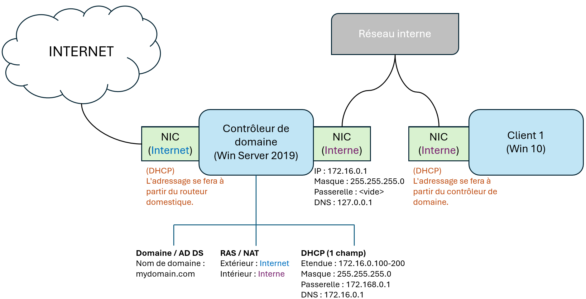

---

## Project steps

### 1. Create the Windows Server 2019 VM

Create a new VM in VirtualBox for the domain controller and install Windows Server 2019.

> 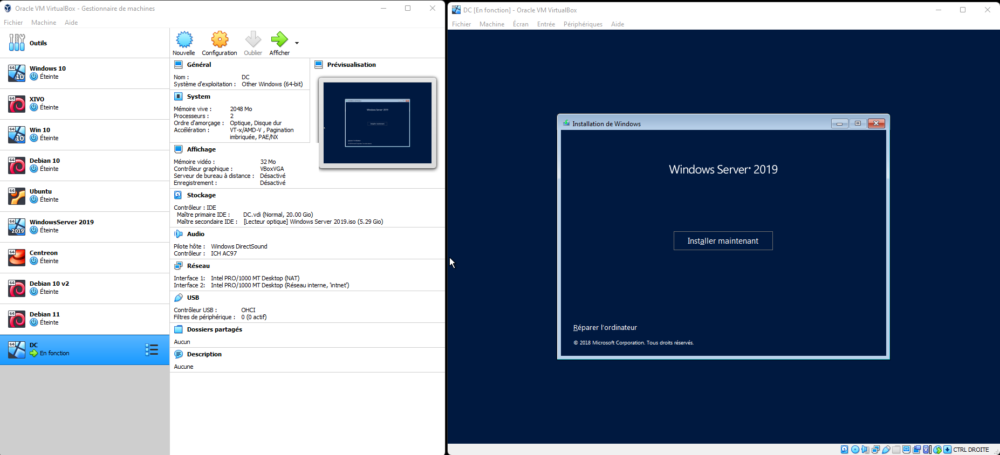

---

### 2. Configure networking on the domain controller

The domain controller has two network adapters:

- **External NIC**: attached to a VirtualBox NAT or bridged adapter (Internet access)
- **Internal NIC**: attached to an internal network (e.g. `InternalNet`)

On the **internal NIC**, configure:

- IP address: `172.16.0.1`
- Subnet mask: `255.255.255.0`
- DNS: `127.0.0.1` (the DC will run DNS)

> 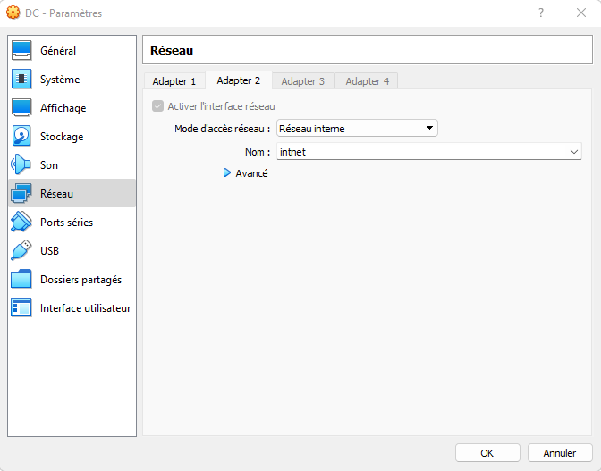  
> 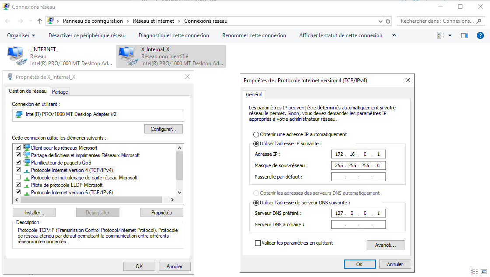

---

### 3. Install AD DS and create the domain

On the server:

1. Add the **Active Directory Domain Services** role.
2. Promote the server to a domain controller.
3. Create a new forest and domain (for example: `mydomain.com`).
4. Create a dedicated domain admin account and use it for the rest of the lab.

> 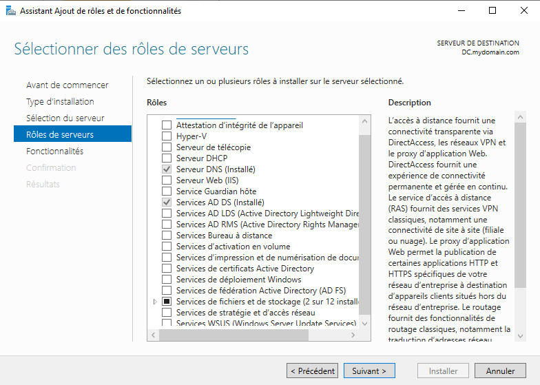  
> 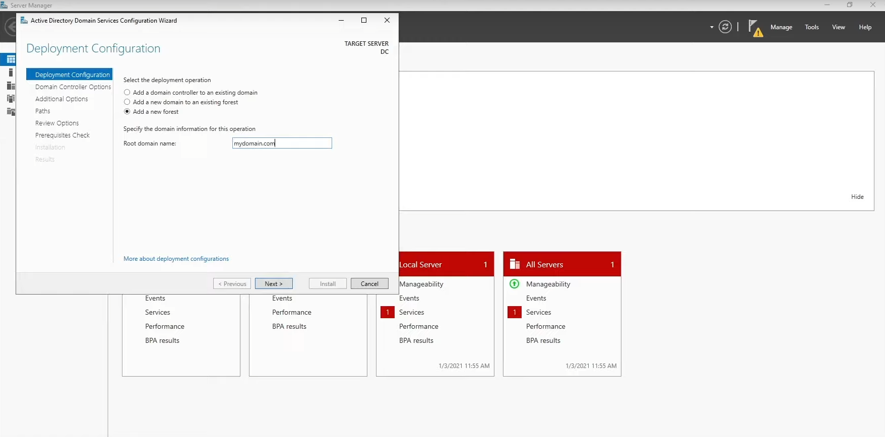

---

### 4. Configure routing and NAT (RRAS)

To allow the internal network to access the Internet:

1. Install the **Remote Access** role.
2. Configure **Routing and Remote Access** in NAT mode.
3. Set the **external NIC** as the public interface.
4. Enable NAT so traffic from `172.16.0.0/24` is translated out to the Internet.

> 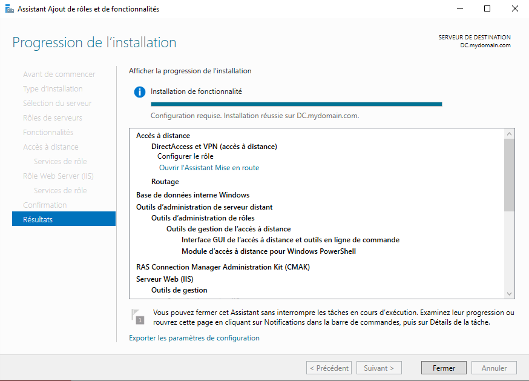  
> 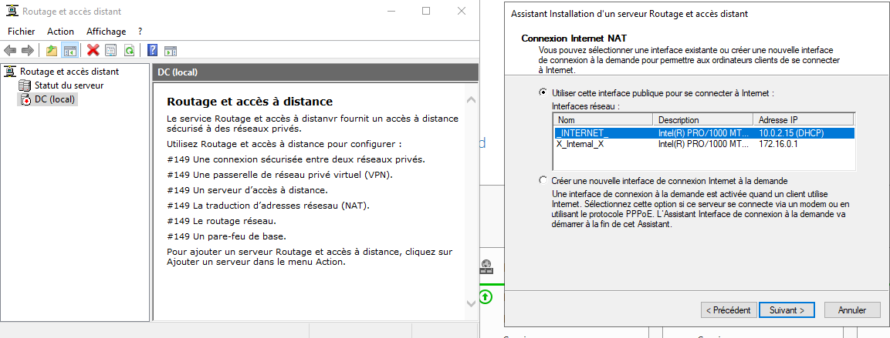

---

### 5. Install and configure DHCP

On the domain controller:

1. Install the **DHCP Server** role.
2. Create a scope for the internal network, for example:
   - Network: `172.16.0.0`
   - Mask: `255.255.255.0`
   - Scope: `172.16.0.100` – `172.16.0.200`
3. Configure DHCP options:
   - Default gateway: internal IP of the DC (`172.16.0.1`)
   - DNS server: `172.16.0.1`
   - DNS domain: `mydomain.com`

> 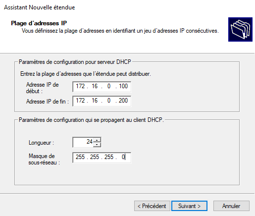  
> 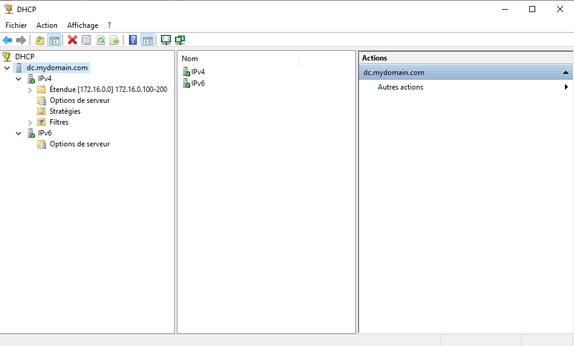

---

### 6. Prepare the user list

On the DC, create a working folder (for example `C:\AD-Lab\`) and copy the `names.txt` file there.

A sample `names.txt` file is provided in this repository under `data/names.txt`, so you can use it as-is for testing or replace it with your own file using the same format.

> 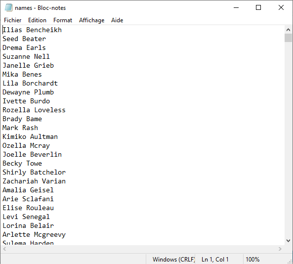

---

### 7. PowerShell script – automatic user creation

The script `Create-Users.ps1` runs on the domain controller and automates the creation of Active Directory users based on the `names.txt` file.

It performs the following actions:

1. Reads the `names.txt` file (for example from `C:\AD-Lab\data\names.txt`).
2. Splits each line into `FirstName` and `LastName`.
3. Builds:
   - `sAMAccountName` (e.g. `jdoe`)
   - `UserPrincipalName` (e.g. `jdoe@mydomain.com`)
   - Display name (e.g. `John Doe`)
4. Creates the users in a target OU (for example: `OU=Users,DC=mydomain,DC=com`).
5. Sets an initial password and can enforce **User must change password at next logon**.

Run the script from an elevated PowerShell session on the domain controller:

> 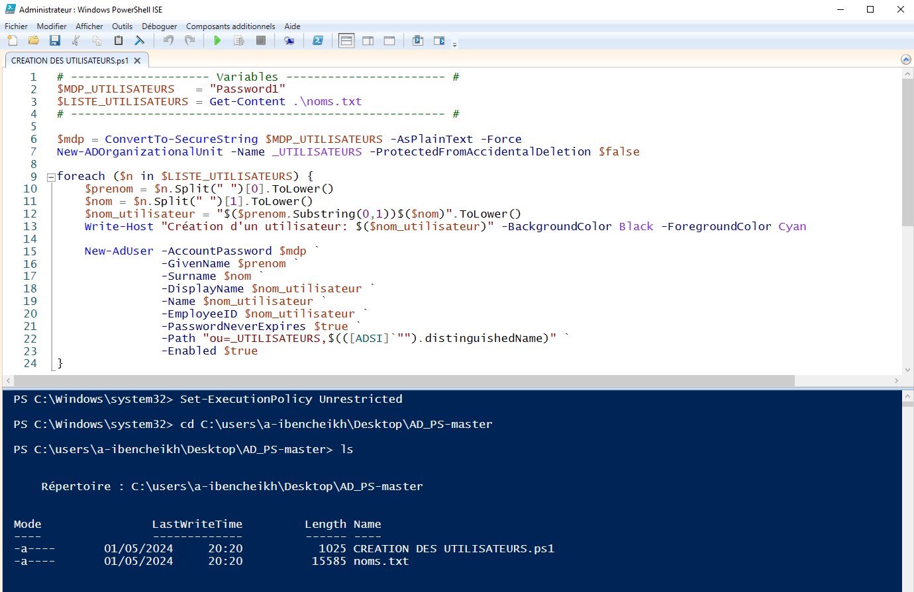
> 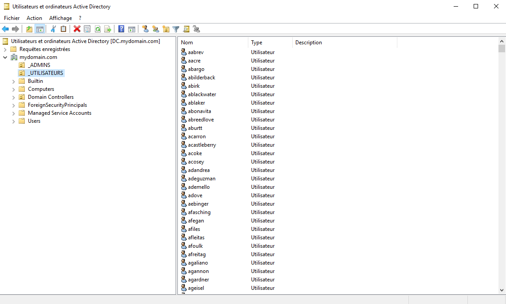

--

### 8. Create the Windows 10 client and join the domain

Create a second VM in VirtualBox for the client:

- Attach its NIC to the same **internal network** as the domain controller.
- Leave the IP configuration in **DHCP** mode so it gets its address from the DC.

The client should obtain:

- An IP address in `172.16.0.100–200`
- Default gateway: `172.16.0.1`
- DNS: `172.16.0.1`

Verify the configuration with `ipconfig` from a command prompt.

>   
> 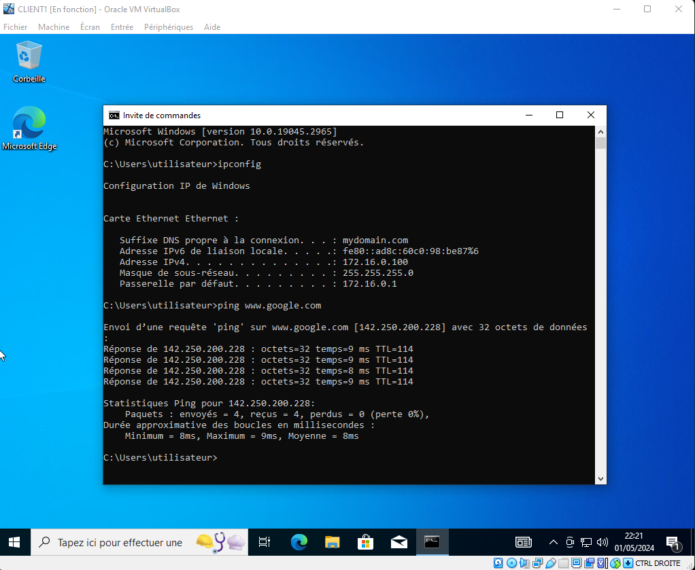

Then join the machine to the domain:

1. Open **System properties**.
2. Click **Change settings** for computer name.
3. Join the domain `mydomain.com`.
4. Provide domain admin credentials when prompted.
5. Restart the client and log in with a domain account.

> 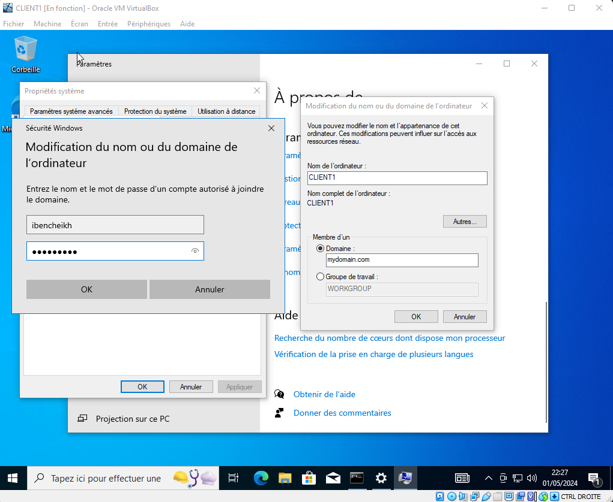

---

### 9. Validate user logon

To validate the full setup:

1. Pick a random user that was created by the PowerShell script.
2. Log in to the client with this domain account.
3. Confirm that:
   - The logon is successful.
   - The account exists in **Active Directory Users and Computers**.
   - The `whoami` command returns the correct `DOMAIN\username`.

> 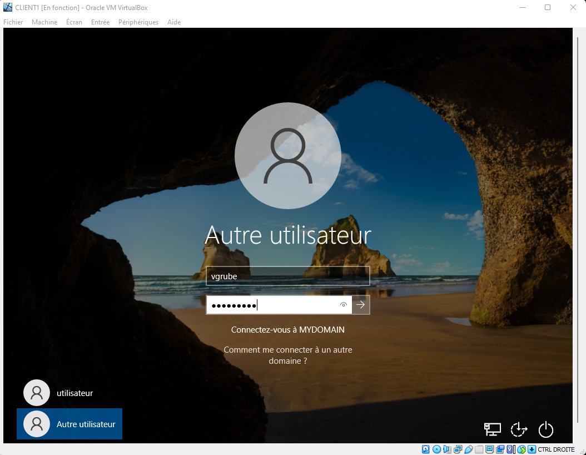  
> 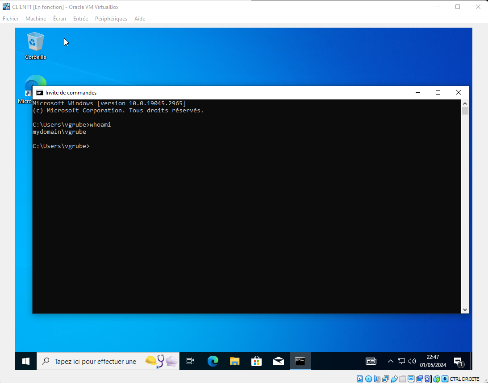

---

## Conclusion

This lab provides a complete, end-to-end **Active Directory baseline** in an isolated environment: a domain controller delivering **AD DS/DNS**, internal **DHCP**, and **NAT (RRAS)**, plus a Windows 10 client successfully joined to the domain. It also demonstrates a practical automation use case by **bulk-creating users from a text file via PowerShell** and validating real logons from the client.

**Next improvements** could include: structuring users with multiple **OUs + GPOs**, implementing stronger **password/account lockout policies**, creating **security groups** and mapping permissions (shared folders), and extending the script to handle duplicates, logging, and group assignments.
